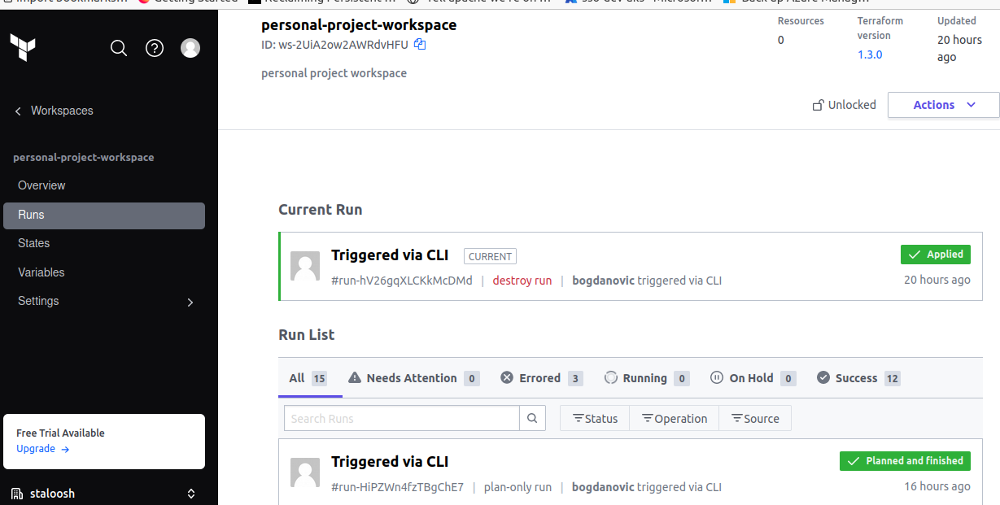

# Personal project
## _A CI/CD, IaaC project_

This IaaC project has the following steps:

- Build a litecoin docker image using a custom-made Dockerfile
- Write Kubernetes manifests to use this docker image in a statefulset controller
- Write a build and deploy pipeline using a Jenkinsfile for the above resources
- Create scripts in bash and python to resolve a text manipulation problem
- Construct a terraform module to deploy resources to AWS
## Step 1 - Build docker image

The constructed [Dockerfile](Dockerfile) aims to run a litecoin 0.18.1 daemon. In order to reduce the attack surface and also have a smaller image at the end, I decided to implement a multi-stage Dockerfile.

In order to verify the checksum of the downloaded package I created a separate script [checksum.sh](checksum.sh) and also imported the gpg public key and verified the signature.
This was done based on this [documentation](https://download.litecoin.org/README-HOWTO-GPG-VERIFY-TEAM-MEMBERS-KEY.txt).
The docker image will be run as a non-privileged user as seen [here](https://github.com/staloosh/personal-project/blob/cb701c0b7e1fdc601a12396a5ca5c1da5dfe289b/Dockerfile#L61).

The above mentioned strategies, multi-stage build and using a non-privileged user take into consideration the security aspect of the image.
### 1.1 Running the docker image manually
```sh
docker image build -t litecoin:latest .
```
```sh
docker run -dit --name=litecoind -p 9332:9332 litecoin:latest
```
## Step 2 - Create Kubernetes manifests
For this project, the needed Kubernetes resource to use the previously created image is a statefulSet.
I am using a k3s cluster that I host in my home server, configured with one controlplane and one worker node.
In order to package the resources properly and make use of proper Kubernetes releases, I chose Helm for templating and releases.

The Helmchart template was generated by running the following command:
```sh
helm create litecoin
```
This ensures all the necessary files are present before modifying them with the appropriate values.
A persistent volume claim was used and also resource limits based on observed local resource consumption.
All the custom values are defined in the [values/test.yaml](https://github.com/staloosh/personal-project/blob/main/kubernetes/litecoin-chart/values/test.yaml) file

Security conscious implementation: 
- new service account named litecoin
- drop all capabilities in [securityContext](https://github.com/staloosh/personal-project/blob/cb701c0b7e1fdc601a12396a5ca5c1da5dfe289b/kubernetes/litecoin-chart/values/test.yaml#L18)
- set automountServiceAccountToken to [false](https://github.com/staloosh/personal-project/blob/cb701c0b7e1fdc601a12396a5ca5c1da5dfe289b/kubernetes/litecoin-chart/templates/statefulset.yaml#L29)
- runAsUser, runAsGroup were set to 1555 at container level
- fsGroup 1555 was set at pod level
- separate namespace crypto - not really a security feature but nice to have

### 2.1 Running the helmchart manually
While being in the root of the cloned repository run the following:
```sh
kubectl create ns crypto
helm -n crypto install -f kubernetes/litecoin-chart/values/test.yaml litecoin kubernetes/litecoin-chart
```
Afterwards we can test the connection:
```sh
helm -n crypto test litecoin --logs
```

The result will look somthing like this:


## Step 3 - Construct Jenkins pipeline
For this step I used a Jenkins server that is running in my home server.
Extra packages that were installed on the Jenkins server in order to be used in the pipeline:
- Git
- Kubectl
- Helm
- Docker

For the pipeline itself I went with a declarative pipeline which has the following steps:
- Build the docker image
- Scan the docker image with Trivy (this tool was chosen as it is the recommended one for CKS )
- Do another scan, this time by using Snyk(via docker scan) - this scan is just for comparison
- Deploy docker image to dockerhub
- Cleanup the docker images from local Jenkins server
- Deploy all Kubernetes manifests to k3s with the help of Helm
     > Note: Here, I also added a step to see the manifests after templating
- Test if the Kubernetes service is running properly and that it has the proper pod endpoints - done through helm test

Pipeline stages in the Jenkins UI:


The Scan with Snyk fails because of running more than 10 scans/month

## Step 4 & 5 - Write scripts to solve a text manipulation problem
While trying to debug my self hosted Kubernetes cluster in order to test the helmchart that I wrote for Step2, i was searching the journals to find more details - only to find out that the certificates were expired, therefore for this step I thought about writing scripts for the following problem: 

Search through logs extracted from journalctl for the **k3s** service and find all the lines with the keyword **error** or **failed** and afterwards print&save only the error message(what occurs after 'msg').

I tried to write the same multiple-choice script in both **bash** & **python**, which would ask the user for input, choosing between "error" or "failed" and afterwards doing the magic, parsing the [journal.log](scripts/journal.log) file with **grep** & **awk** when it comes to the bash script and with script partitioning in python.

## Step 6 - Write a terraform module to deploy IAM resources to AWS
First things first, I opted to use **Terraform Cloud** as a remote backed, as it is very similar to a self hosted **Terraform Enterprise** instance. Terraform Cloud provides GUI runs, vizualization of workspaces, states and also allows defining sensitive variables (i.e. AWS secret keys).
The terraform module was defined under terraform/modules/iam based on the standard module structure documented [here](https://www.terraform.io/language/modules/develop/structure). I also implemented some other best practices such as defining providers into providers.tf and versions in versions.tf.

The AWS credentials were set in Terraform Cloud as sensitive variables.

The module creates the following resource:
- AWS IAM ROLE - with no permissions
- AWS IAM GROUP POLICY
- AWS IAM GROUP
- AWS IAM USER

The module outputs all of the names of the above mentioned resources, and these can be referenced in the root module output as such [outputs.tf](terraform/outputs.tf).

By default the terraform code will run with the variable **environment** with a value of **test** and will create all resources with the following naming structure _environment_-_application_-_resourceType_, the default is **test-lite-role**.
In order to be able to change the prefix of the created resources I created two additional tfvars files under the [env](terraform/env) directory for dev and prod environments.

Also, to simplify running terraform commands I created a [Makefile](terraform/Makefile) which allows to init, plan, deploy and destroy based on  chosen environment.

Terraform cloud run:


